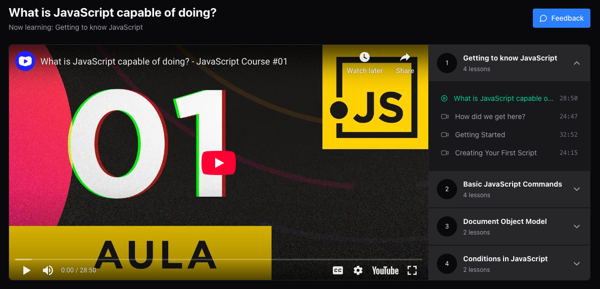

# Player | Zustand | Tailwind

A React application demonstrating state management using Zustand, featuring a video player with modules and lessons.



## 📋 Prerequisites

- Node.js (version specified in `.nvmrc`)
- Yarn Package Manager

## 🛠️ Installation

1. Clone the repository:

```bash
git clone [repository-url]
cd player-modules-lessons-zustand
```

2. Install dependencies:

```bash
yarn install
```

## 🚀 Running the Application

### Development Mode

1. Start the development server:

```bash
yarn dev
```

2. Start the mock API server:

```bash
yarn server
```

By default, the application will be available at `http://localhost:5173`

## 🧪 Testing

### Run tests in watch mode:

```bash
yarn test:watch
```

### Run tests once:

```bash
yarn test
```

## 📁 Project Structure

```
player-modules-lessons-zustand/
├── src/              # Source code
├── public/           # Static assets
│   └── images/       # Image assets
├── vite.config.ts    # Vite configuration
├── tsconfig.json     # TypeScript configuration
├── package.json      # Project dependencies and scripts
└── server.json       # JSON Server configuration
```
